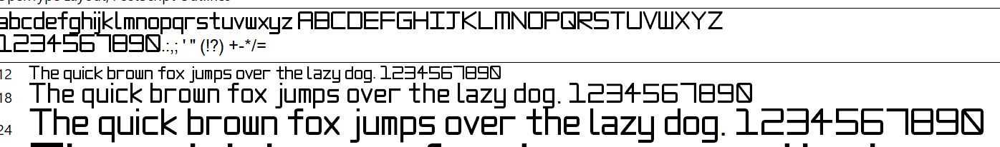

# MoaM Sans

My custom display font

## build instructions

- cd into `moamsans`
- run `[fontforge install location]\bin\ffpython[.exe if on windows] generatefontforge.py`
  - replace the stuff inside the `[]`